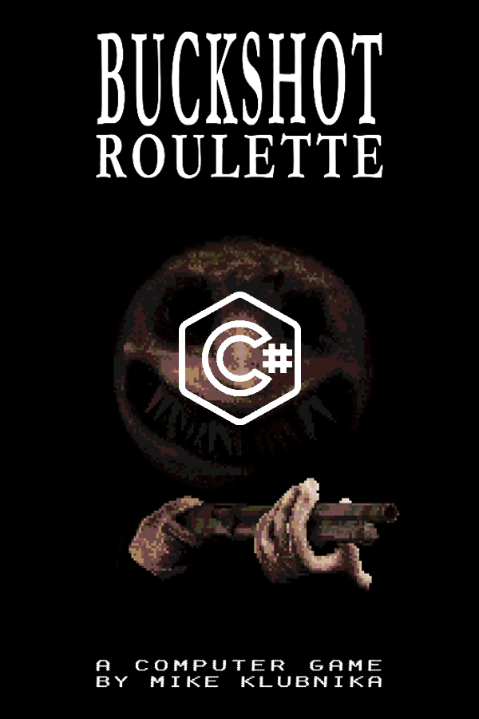

<a name="readme-top"></a>

#  *Still work in progress... !*
<div align="center">
  
  
  <br/>

  <h3><b>Buckshot - Remake</b></h3>

</div>

<!-- TABLE OF CONTENTS -->

# 📗 Table of Contents

- [📖 About the Project](#about-project)
  - [🛠 Built With](#built-with)
    - [Tech Stack](#tech-stack)
    - [Key Features](#key-features)
  - [🚀 Live Demo](#live-demo)
- [💻 Getting Started](#getting-started)
  - [Prerequisites](#prerequisites)
  - [Setup](#setup)
  - [Install](#install)
  - [Usage](#usage)
  - [Run tests](#run-tests)
  - [Deployment](#deployment)
- [👥 Authors](#authors)
- [🔭 Future Features](#future-features)
- [⭐️ Show your support](#support)
- [🙏 Acknowledgements](#acknowledgements)
- [❓ FAQ ](#faq)
- [📝 License](#license)

<!-- PROJECT DESCRIPTION -->

# 📖 Buckshot_Roulette-CS <a name="about-project"></a>

> Good to know.

**[Buckshot_Roulette-CS]** <br>
Welcome to the BuckShot Project made by **Gold_dt**! Built with C#, .NET 8.0, and uses modern features and tools. The main focus is on efficiency, creativity and training. Feel free to explore and customize it according to the terms given in the github MIT license and other files!Copyright:  © 2024 Gold_dt. All rights reserved.


## 🛠 Built With <a name="built-with"></a>

### Tech Stack <a name="tech-stack"></a>

> *Just in case you didnt figured it out*

<details>
  <summary>Language</summary>
  <ul>
    <li><a href="https://learn.microsoft.com/en-us/dotnet/csharp/">C#</a></li>
  </ul>
</details>

<details>
  <summary>Framework</summary>
  <ul>
    <li><a href="https://learn.microsoft.com/en-us/dotnet/">.Net 8.0</a></li>
  </ul>
</details>

<details>
<summary>IDE</summary>
  <ul>
    <li><a href="https://visualstudio.microsoft.com/">VS</a></li>
    <ul><li>Console APP</li></ul>
  </ul>
</details>

<!-- Features -->

### Key Features <a name="key-features"></a>

> Some thing that good to know.

- **Modular**
- **Colorfull**
- **Accessible**
- **Modern**

<p align="right">(<a href="#readme-top">back to top</a>)</p>

<!-- LIVE DEMO -->

## 🚀 Live presentation <a name="live-demo"></a>

> Add a link to your deployed project.

- Dev Card


<p align="right">(<a href="#readme-top">back to top</a>)</p>

<!-- GETTING STARTED -->

## 💻 Getting Started <a name="getting-started"></a>

> Describe how a new developer could make use of your project.

To get a local copy up and running, follow these steps.

### Prerequisites

In order to run this project you need:

<!--
Example command:

```sh
 gem install rails
```
 -->

### Setup

Clone this repository to your desired folder:

<!--
Example commands:

```sh
  cd my-folder
  git clone git@github.com:myaccount/my-project.git
```
--->

### Install

Install this project with:

<!--
Example command:

```sh
  cd my-project
  gem install
```
--->

### Usage

To run the project, execute the following command:

<!--
Example command:

```sh
  rails server
```
--->

### Run tests

To run tests, run the following command:

<!--
Example command:

```sh
  bin/rails test test/models/article_test.rb
```
--->

### Deployment

You can deploy this project using:

<!--
Example:

```sh

```
 -->

<p align="right">(<a href="#readme-top">back to top</a>)</p>

<!-- AUTHOR -->

## 👥 Author <a name="authors"></a>

> Who made that

👤 **Gold_dt**

- GitHub: [@Gold-dt](https://github.com/Gold-dt)

# Projekt Card


<p align="right">(<a href="#readme-top">back to top</a>)</p>

<!-- FUTURE FEATURES -->

## 🔭 Future Features <a name="future-features"></a>

> The feature`s if the project become popular

-(https://placehold.co/15x15/c5f015/c5f015.png)   **New items**

<p align="right">(<a href="#readme-top">back to top</a>)</p>

<!-- SUPPORT -->

## ⭐️ Show your support <a name="support"></a>

>  `Thanks for reading this`

If you like this project then give it a star

<p align="right">(<a href="#readme-top">back to top</a>)</p>

<!-- ACKNOWLEDGEMENTS -->

## 🙏 Acknowledgments <a name="acknowledgements"></a>

> This project is based on the popular 3D game on steam thats called [BuckShot Roulette](https://store.steampowered.com/app/2835570/Buckshot_Roulette/)

So yeah thats all the where i got all the ideas

<p align="right">(<a href="#readme-top">back to top</a>)</p>

<!-- FAQ (optional) -->

## ❓ FAQ  <a name="faq"></a>

> If any question is frequently asked, it will be marked.

- **[None]**

  - [Answer: None]

<p align="right">(<a href="#readme-top">back to top</a>)</p>

<!-- LICENSE -->

## 📝 License <a name="license"></a>

This project is [MIT](./LICENSE) licensed.

_NOTE: we recommend using the [MIT license](https://choosealicense.com/licenses/mit/) - you can set it up quickly by [using templates available on GitHub](https://docs.github.com/en/communities/setting-up-your-project-for-healthy-contributions/adding-a-license-to-a-repository). You can also use [any other license](https://choosealicense.com/licenses/) if you wish._

<p align="right">(<a href="#readme-top">back to top</a>)</p>
